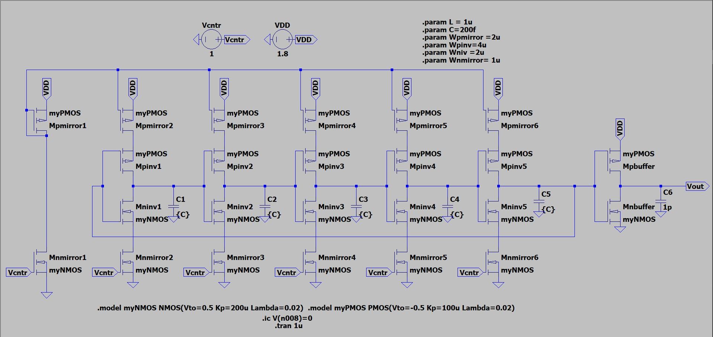
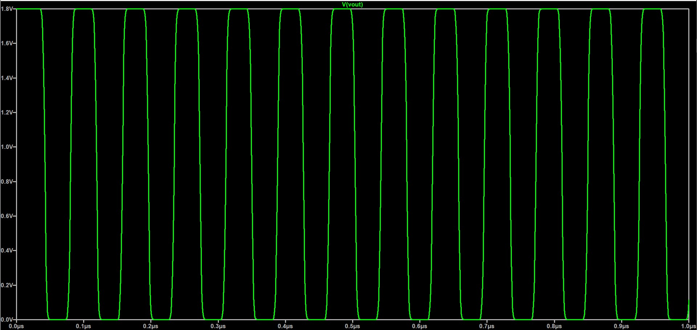
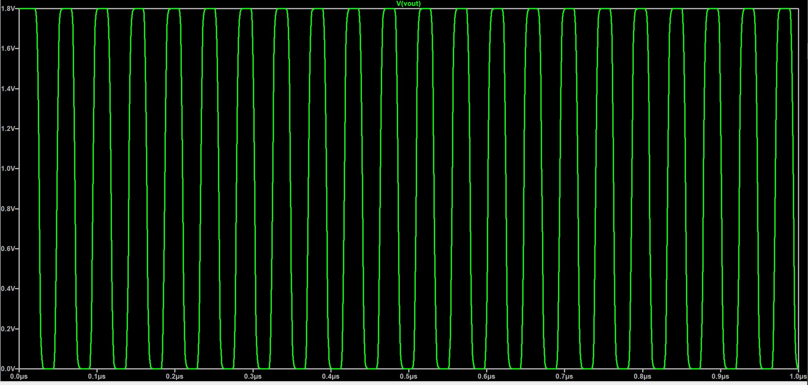
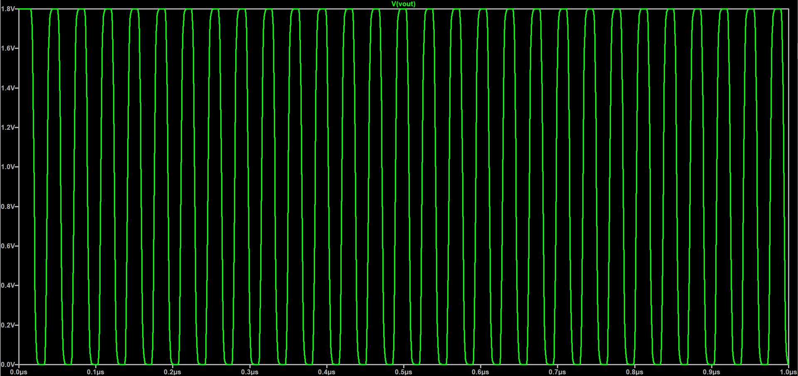
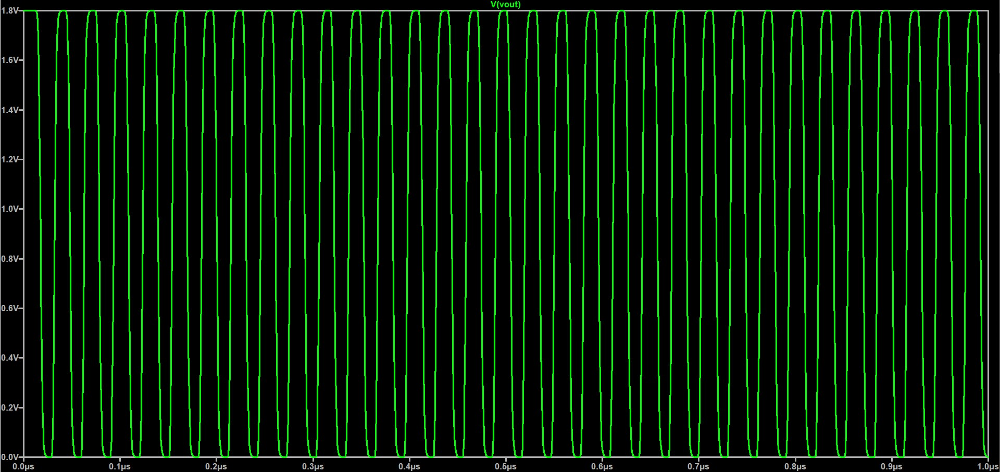
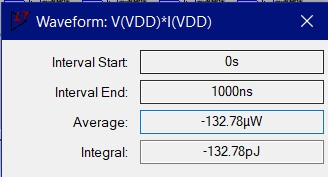

# CMOS Current Starved Voltage Controlled Oscillator VCO

A complete transistor-level VCO. The circuit provides a pulse, whose frequence is controlled by the value of the Voltage source Vcntr. 5 inverters, placed as a Ring Oscillator topology, are used to achieve the pulse output, with a capacitor between 2 inverters to stabilze the circuit. All the inverters are provided with 25.4μΑ, by a PMOS and a NMOS current mirror, placed above and bellow them. The second stage consists of an inverter Buffer, that is 2x wider than the other inverters, who is responsible for isolating the output, but also making the Voltage swings more rapid .The circuit achieves consumption < 150μJ. The command ".ic V(n008)=0 " is used for Breaking DC Equilibrium.

All simulations and validations were performed in **LTspice**.

## Key Specifications

| Parameter | Value / Description |
| :--- | :--- |
| **Technology** | Generic NMOS Vth= 0.5V Kp=200u Lambda=0.02 (W/L) = (4u/1u), Generic NMOS Vth= 0.5V Kp=200u Lambda=0.02 (W/L) = (2u/1u), Generic NMOS Vth= 0.5V Kp=200u Lambda=0.02 (W/L) = (1u/1u), Generic PMOS Vth=-0.5V Kp=100u Lambda=0.02 (W/L) = (8u/1u), Generic PMOS Vth=-0.5V Kp=100u Lambda=0.02 (W/L) = (4u/1u), Generic PMOS Vth=-0.5V Kp=100u Lambda=0.02 (W/L) = (2u/1u), |
| **Supply Voltage (VDD)** | 1.8V |
| **Virtual Ground / DC Bias** | 0V |
| **Input Control Signal Amplitude** | 1V |
| **Current** | 25.4μΑ |
| **Load Capacitor** | 1pF |
| **Delay Capacitor** | 200fF |

## Transistor W/L Reference Table
| Name |Type | W/L |
| :--- | :--- | :--- |
|**Mnmirror1**| NMOS | 1u/1u |
|**Mnmirror2**| NMOS | 1u/1u |
|**Mnmirror3**| NMOS | 1u/1u |
|**Mnmirror4**| NMOS | 1u/1u |
|**Mnmirror5**| NMOS | 1u/1u |
|**Mnmirror6**| NMOS | 1u/1u |
|**Mpmirror1**| PMOS | 2u/1u |
|**Mpmirror2**| PMOS | 2u/1u |
|**Mpmirror3**| PMOS | 2u/1u |
|**Mpmirror4**| PMOS | 2u/1u |
|**Mpmirror5**| PMOS | 2u/1u |
|**Mpmirror6**| PMOS | 2u/1u |
|**Mpinv1**| PMOS | 4u/1u |
|**Mpinv2**| PMOS | 4u/1u |
|**Mpinv3**| PMOS | 4u/1u |
|**Mpinv4**| PMOS | 4u/1u |
|**Mpinv5**| PMOS | 4u/1u |
|**Mninv1**| NMOS | 2u/1u |
|**Mninv2**| NMOS | 2u/1u |
|**Mninv3**| NMOS | 2u/1u |
|**Mninv4**| NMOS | 2u/1u |
|**Mninv5**| NMOS | 2u/1u |
|**Mpbuffer**| PMOS | 8u/1u |
|**Mnbuffer**| NMOS | 4u/1u |

## Schematics & Simulation Results

### Schematic

### Transient Analysis
The system was evaluated using the values 1V, 1.2V, 1.5V, 1.8V for the voltage source Vcntrl to test the frequence change.

### Vcntr = 1V

### Vcntr = 1.2V

### Vcntr = 1.5V

### Vcntr = 1.8V

### Consumption

---
